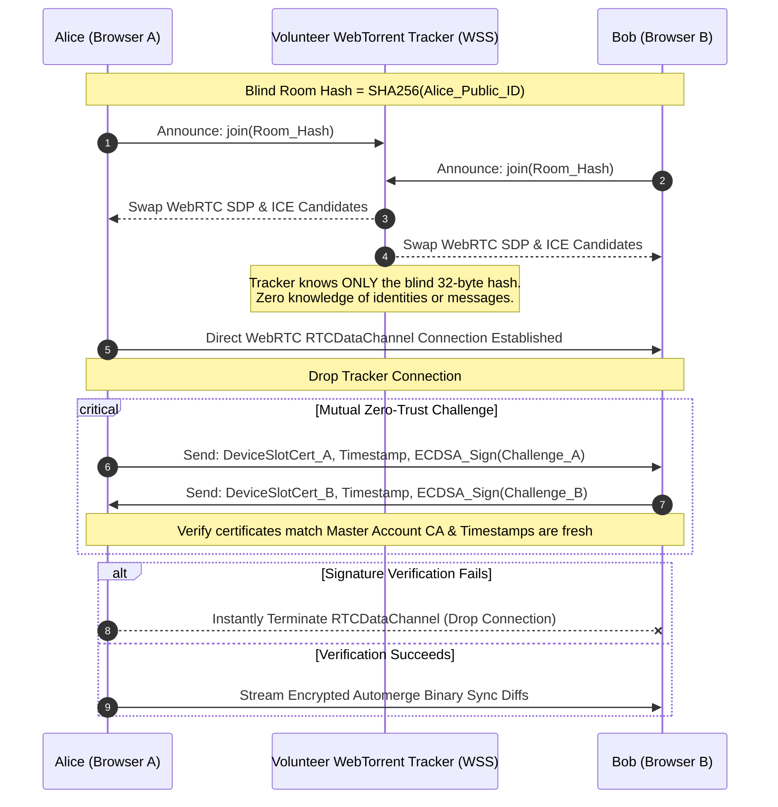
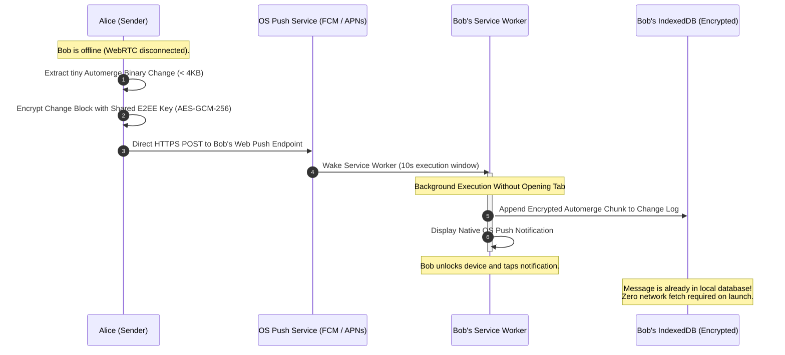

# Architecture Specification: Sovereign P2P Web Chat (The Serverless Matrix)

> **Document Status:** Production Architectural Blueprint  
> **Target Runtime:** 100% Client-Side Modern Web Browser (Sandboxed PWA)  
> **Philosophy:** Absolute Data Sovereignty • Zero-Central Servers • Zero-Knowledge Relay Handshakes • Offline-First CRDT

---

## 1. Executive Summary & Core Vision

**Murmur** is an open-source, serverless, decentralized, offline-first peer-to-peer web communication platform. It delivers the seamless, frictionless user experience of modern centralized messaging applications (such as Signal or WhatsApp)—complete with multi-device synchronization, background notifications, and zero-conflict document merging—while maintaining the uncompromising architectural sovereignty of native peer-to-peer engines like Keet.io.

### The Invariants:

1. **Zero Central Database & Zero Application Servers**: There is no backend, no central PostgreSQL/Redis, no hosted messaging middleware, and no accounts database.
2. **Zero-Trace Signaling Matchmakers**: Public, decentralized couriers (BitTorrent WebTorrent trackers and Nostr relays) are utilized strictly as ephemeral, blind matchmakers to exchange WebRTC SDP offer/answer coordinates. Once the direct peer-to-peer data pipe opens, signaling infrastructure is completely dropped.
3. **Local-First & Offline-First**: All application state exists locally on disk in encrypted IndexedDB tables powered by **Automerge CRDTs**. The application functions with sub-millisecond responsiveness with zero network connectivity.
4. **Zero-RAM Large File Streaming**: Large file transfers (up to multiple gigabytes) are streamed directly from disk to disk using the **Origin Private File System (OPFS)** via Web Workers and `ReadableStream` pipelines, entirely bypassing browser tab memory limits.
5. **Deterministic Device Slots**: Physical hardware instances are provisioned as cryptographically pre-signed slots derived deterministically from a 24-word master seed, eliminating live-pairing race conditions and preventing master seed leakage to secondary devices.

---

## 2. System Architecture Layers

The system is partitioned into four distinct execution and storage tiers within the browser sandbox:

```
┌────────────────────────────────────────────────────────────────────────┐
│                        USER INTERFACE LAYER                            │
│         (Tailwind CSS v4 + React 19 + WebAuthn Bio-Unlock)             │
└──────────────────────────────────┬─────────────────────────────────────┘
                                   │
         ┌─────────────────────────┴─────────────────────────┐
         ▼                                                   ▼
┌───────────────────────────────┐                   ┌────────────────────┐
│      SERVICE WORKER           │                   │    WEB WORKER      │
│  (Background Push Listener)   │                   │ (The Heavy Engine) │
└────────┬──────────────────────┘                   └────────┬───────────┘
         │                                                   │
         │ (Writes 4KB Encrypted Payloads)                   │ (Streams WebRTC
         │                                                   │  & Chunked Files)
         ▼                                                   ▼
┌────────────────────────────────────────────────────────────────────────┐
│                        LOCAL STORAGE LAYER                             │
│  - IndexedDB (Automerge Change Logs - Encrypted-at-Rest via PIN)       │
│  - OPFS (Direct-to-Disk High-Speed Large Binary File Streaming)        │
└────────────────────────────────────────────────────────────────────────┘
```

### Component Breakdown

| Layer              | Execution Context                 | Core Responsibilities                                                                                                               |
| :----------------- | :-------------------------------- | :---------------------------------------------------------------------------------------------------------------------------------- |
| **User Interface** | Main DOM Thread                   | React 19 rendering, Tailwind styling, reactive state subscriptions, user input validation, biometric WebAuthn prompt.               |
| **Service Worker** | Background Thread                 | PWA application shell caching, offline boot, Web Push notification ingestion, 10s wake window background delta append to IndexedDB. |
| **Web Worker**     | Worker Thread (`heavy-worker.ts`) | Automerge binary state calculations, file chunking (16KB blocks), AES-GCM stream encryption/decryption, OPFS file handle piping.    |
| **Storage Layer**  | Browser Sandboxed Storage         | Encrypted-at-rest IndexedDB (`idb` / Dexie) for Automerge CRDT change logs; OPFS for high-speed binary media streaming.             |

---

## 3. The Production Technology Stack

| Layer                     | Technology                                         | Operational Purpose                                                                                                                                                                       |
| :------------------------ | :------------------------------------------------- | :---------------------------------------------------------------------------------------------------------------------------------------------------------------------------------------- |
| **Identity / Seed**       | `@scure/bip39`                                     | Converts 24-word cryptographic mnemonics into a 512-bit master binary seed.                                                                                                               |
| **Cryptography Core**     | **Web Crypto API**                                 | Native, C++-accelerated browser primitives for asymmetric signing (**ECDSA P-256**) and symmetric authenticated data locking (**AES-GCM-256**). Key derivation via **PBKDF2** & **HKDF**. |
| **Data Structure Engine** | **Automerge (CRDT)**                               | Append-only cryptographic change log to merge concurrent, offline mutations with zero central authority conflict.                                                                         |
| **Signaling Adapter**     | **Trystero (BitTorrent Primary + Nostr Fallback)** | Connects to public, volunteer WebTorrent WebSocket trackers (with fallback to Nostr relays) solely to swap WebRTC ICE connection coordinates.                                             |
| **Network Pipe**          | **WebRTC `RTCDataChannel`**                        | Direct, raw browser-to-browser encrypted data conduits. Fully bypassed and independent of relays after initial handshake.                                                                 |
| **Background Sync**       | **Web Push API**                                   | Dispatches standard encrypted JSON notifications to recipient client-device OS endpoints via direct HTTPS POST requests from peer clients.                                                |
| **Database Storage**      | **IndexedDB (`idb` / Dexie)**                      | Client-side, persistent record storage. Fortified at-rest via password-derived AES-GCM-256 key encryption.                                                                                |
| **File Storage Pipeline** | **OPFS (Origin Private File System)**              | High-speed, zero-RAM browser file handle streams to disk, bypassing web page execution memory limits.                                                                                     |

---

## 4. The 5 Core Architectural Pillars

### Pillar 1: Identity & Pre-Authenticated Device Slots

Sharing a single private key across multiple physical devices in a peer-to-peer network causes WebRTC signaling collisions, ratchet state desynchronization, and makes selective revocation impossible. Murmur implements a **Deterministic Master-Slot CA Model**:

```
                 ┌──────────────────────────────────────────────┐
                 │             Account Root Identity            │
                 │      (Master 24-Word BIP-39 Seed Phrase)     │
                 │           Master Public Account ID           │
                 │          Master ECDSA P-256 Signing Key      │
                 └──────────────────────┬───────────────────────┘
                                        │
           HKDF-SHA256 Derivation (info: `murmur-device-slot-N`)
                                        │
         ┌──────────────────────────────┼──────────────────────────────┐
         ▼                              ▼                              ▼
┌──────────────────┐           ┌──────────────────┐           ┌──────────────────┐
│  Device Slot #0  │           │  Device Slot #1  │           │  Device Slot #2  │
│  (Primary Phone) │           │ (Laptop Chrome)  │           │ (Tablet Safari)  │
│  Slot Keypair    │           │ Slot Keypair     │           │ Slot Keypair     │
│  + Pre-Signed    │           │ + Pre-Signed     │           │ + Pre-Signed     │
│    Master Cert   │           │   Master Cert    │           │   Master Cert    │
└──────────────────┘           └──────────────────┘           └──────────────────┘
```

1. **Master Derivation**:
   - The user inputs their 24-word BIP-39 mnemonic.
   - Derives a 512-bit master binary seed.
   - Derives the **Master Public ID** (canonical account address, e.g. `0xABC...`) and the **Master ECDSA P-256 Signing Key**.
2. **Pre-Authenticated Device Slots**:
   - The master key deterministically derives a fixed array of 10 to 20 **Device Identity Slots** via HKDF (`info: murmur-slot-0`, `murmur-slot-1`, ...).
   - The master key **pre-signs** each slot's public key into a cryptographically sealed `DeviceSlotCertificate`.
3. **Zero-Seed Device Provisioning (QR Sync Package)**:
   - To link a secondary device (e.g. laptop), the primary device displays a QR sync package containing only that assigned slot's private key and master certificate.
   - The secondary device scans the QR code, importing its isolated slot identity.
   - **Critical Security Guarantee**: Secondary devices never hold, see, or touch the 24-word master seed phrase. If a laptop is stolen, only that individual slot is invalidated.

---

### Pillar 2: Local-First Storage Architecture (Automerge + Encrypted IndexedDB)

Chat text does not exist as raw strings in an unencrypted database. Every channel is initialized as a discrete, independent **Automerge CRDT document**:

```
[ User Types Message ]
          │
          ▼
Automerge Document (In-Memory Change Log)
          │
          ├─► 1. Commit Local Binary Change State (< 1ms UI response)
          │
          ▼
AES-GCM-256 Cipher (Key derived from User Passcode via PBKDF2)
          │
          ▼
IndexedDB Storage Layer (Encrypted Blob at Rest)
```

1. **Conflict-Free Replication**:
   - Every mutation (message sent, reaction added, room metadata change) appends an immutable binary change chunk to the Automerge document.
   - Even after weeks of offline isolation, concurrent edits merge deterministically without data loss, conflicts, or central coordinators.
2. **At-Rest Lockdown (Passcode / PIN Encryption)**:
   - All records committed to IndexedDB are encrypted with **AES-GCM-256**.
   - The symmetric key is derived from a local user passcode/PIN using **PBKDF2** (600,000 iterations of SHA-256) with a unique cryptographic salt.
   - When the user locks the app or the tab is closed, the key is flushed from memory. If the host machine is physically seized or browser files are extracted, all stored data remains unreadable ciphertext.
3. **Biometric Integration (WebAuthn)**:
   - Users can unlock the local encryption key using device biometrics (Touch ID, Face ID, Windows Hello) via the WebAuthn API storing a wrapped key credential.

---

### Pillar 3: Blind Signaling & Gatekeeper Traversal

To discover peers without exposing metadata or communication graphs to public networks, Murmur executes a **Blind Discovery Key Algorithm**:



1. **Blinded Hash Rendezvous**:
   - When Bob wants to contact Alice, both apps independently compute:
     $$\text{Room\_Name} = \text{SHA256}(\text{Alice\_Public\_ID})$$
   - Both apps announce themselves to this 32-byte hash location inside public WebTorrent WebSocket trackers.
   - To the tracker, Alice and Bob appear as anonymous nodes downloading a random torrent piece. The tracker has zero knowledge of who is talking to whom.
2. **Dual-Relay Fallback**:
   - **Primary**: BitTorrent WebSocket trackers (blazing speed, minimal protocol overhead).
   - **Fallback**: If restrictive firewalls block BitTorrent protocol packets, the client automatically falls back to public Nostr relays using an ephemeral blinded room topic hash.
3. **Zero-Trust Gatekeeper Check**:
   - The instant the WebRTC channel opens, peers execute a mutual cryptographic challenge before exchanging any application state.
   - Each peer transmits their `DeviceSlotCertificate`, a recent timestamp, and an ECDSA signature of the peer's connection nonce.
   - If an unauthorized adversary has somehow guessed the room hash, they cannot produce a valid signature authorized by the account CA. The connection is dropped immediately with 0 bytes of conversation leaked.

---

### Pillar 4: Background Push-Payload Synchronization Hybrid

Web browsers pause WebRTC connections when mobile devices are locked or when tabs are closed. Murmur bridges this gap by turning the **Web Push API** into an encrypted low-bandwidth data pipeline:



1. **Direct Peer-to-Push Pipeline**:
   - When Alice sends a message to Bob while his WebRTC peer is offline, Alice's browser takes the tiny Automerge binary change block.
   - Alice encrypts the payload with their pairwise shared encryption key.
   - Alice's browser dispatches an HTTPS POST request directly to Bob's device-specific OS push endpoint (Google FCM or Apple APNs).
2. **10-Second Service Worker Execution Window**:
   - Bob's operating system receives the push and wakes the PWA Service Worker for a strict 10-second window.
   - The Service Worker accesses IndexedDB in the background thread, appends the incoming encrypted Automerge chunk to the local change log, and fires a native OS screen notification.
3. **Instant Rehydration**:
   - When Bob unlocks his phone, the message is already committed to disk. The chat interface renders the new message in 0 milliseconds without waiting for a WebRTC reconnection.

---

### Pillar 5: Infinite File Chunks via OPFS Streaming

Because push payloads are limited to 4KB, large file transfers (images, videos, audio, archives up to multiple gigabytes) run exclusively across direct, active WebRTC data pipes using the **Origin Private File System (OPFS)**:

```
[ Sender: 2GB Video File ]
          │
          ▼
Web Worker: ReadableStream (Chunks into 16KB Blobs)
          │
          ▼
AES-GCM-256 Per-Chunk Encryption
          │
          ▼
WebRTC RTCDataChannel (Direct P2P Binary Pipe)
          │
          ▼
[ Recipient: WebRTC Receiver ]
          │
          ▼
Web Worker: Sequential AES-GCM Decryption
          │
          ▼
OPFS Storage: FileSystemWritableFileStream / FileSystemSyncAccessHandle
          │
          ▼
[ Direct to Physical Disk (RAM Usage: < 20MB) ]
```

1. **Zero-RAM Decoupling**:
   - Traditional web apps load entire files into memory blobs (`FileReader.readAsArrayBuffer`), which causes browser tabs to crash on files larger than a few hundred megabytes.
   - Murmur processes files as a continuous stream in a dedicated **Web Worker**.
2. **Chunking & Flow Control**:
   - A `ReadableStream` reads the source file in sequential **16KB binary array chunks**.
   - Each chunk is encrypted with AES-GCM-256 and dispatched over the WebRTC channel.
   - Channel backpressure (`bufferedAmountLowThreshold`) is monitored to prevent buffer overflows.
3. **Direct-to-Disk OPFS Writes**:
   - On the receiving device, incoming chunks are decrypted on the fly and piped immediately into an **Origin Private File System** write handle (`FileSystemSyncAccessHandle` or `FileSystemWritableFileStream`).
   - The data is written straight to physical disk. Even during a 5GB transfer, memory consumption remains flat under 20MB, eliminating memory pressure and preventing tab termination.

---

## 5. Security & Threat Model

| Threat Vector                  | Potential Attack                                          | Murmur Architectural Mitigation                                                                                                                                                                                                          |
| :----------------------------- | :-------------------------------------------------------- | :--------------------------------------------------------------------------------------------------------------------------------------------------------------------------------------------------------------------------------------- |
| **Rogue Signaling Tracker**    | Snooping on participant identities or message contents.   | **Blind Discovery Keys**: Trackers only receive `SHA256(Alice_Public_ID)`. They never see public keys, IP pairings, or chat payloads. WebRTC transport uses mandatory DTLS encryption.                                                   |
| **Unauthorized Room Joiner**   | Attacker joins blind room hash guessing the channel.      | **Zero-Trust Mutual Handshake**: Peers must present an authorized `DeviceSlotCertificate` signed by the Master Account CA. Invalid signatures trigger immediate socket termination.                                                      |
| **Physical Device Seizure**    | Attacker accesses local browser storage files.            | **Encrypted-at-Rest IndexedDB**: All database rows are encrypted via AES-GCM-256 with keys derived from the user's PIN via PBKDF2 (600,000 rounds). Ciphertext cannot be decrypted without the PIN.                                      |
| **Secondary Device Theft**     | Compromise of a linked laptop or tablet.                  | **Slot Isolation & Zero Seed Leakage**: Secondary devices only possess an isolated device slot key. The 24-word master mnemonic is never stored on secondary devices. Revoking a slot cuts off access without burning the root identity. |
| **Push Notification Snooping** | Apple or Google inspecting push notification contents.    | **End-to-End Encrypted Push Payloads**: Payloads sent to FCM/APNs are encrypted with the recipient's pairwise AES-GCM key. Apple and Google receive only opaque binary ciphertext.                                                       |
| **Memory Pressure Crashes**    | Malicious peer sends massive file to crash recipient tab. | **OPFS Zero-RAM Streaming**: 16KB chunk streams write directly to disk handles; tab heap never inflates.                                                                                                                                 |

---

## 6. Implementation Roadmap & Phase Deliverables

The software architecture is implemented in five phased engineering milestones:

```
┌────────────────────────────────────────────────────────────────────────┐
│  Phase 1: The Sovereign Triad (Core Engine Foundation)                 │
│  • Module A: BIP-39 Master & Deterministic HKDF Device Slot Keystore   │
│  • Module B: Encrypted-at-Rest Automerge IndexedDB Storage Layer       │
│  • Module C: Blinded Trystero Signaling & WebRTC Automerge Sync Pump   │
└──────────────────────────────────┬─────────────────────────────────────┘
                                   │
                                   ▼
┌────────────────────────────────────────────────────────────────────────┐
│  Phase 2: Multi-Device Slot Provisioning & QR Transfer                 │
│  • Pre-signed slot export/import via offline QR sync packages          │
│  • WebAuthn Biometric Bio-Unlock integration                           │
└──────────────────────────────────┬─────────────────────────────────────┘
                                   │
                                   ▼
┌────────────────────────────────────────────────────────────────────────┐
│  Phase 3: Background Push-Payload Synchronization Hybrid               │
│  • Direct HTTPS POST push dispatch to FCM/APNs                         │
│  • Service Worker 10s background Automerge delta ingestion             │
└──────────────────────────────────┬─────────────────────────────────────┘
                                   │
                                   ▼
┌────────────────────────────────────────────────────────────────────────┐
│  Phase 4: Heavy Engine Web Worker & Large File OPFS Streaming          │
│  • Dedicated Web Worker for crypto and file streaming                  │
│  • 16KB AES-GCM chunking & direct-to-disk OPFS streaming handles       │
└──────────────────────────────────┬─────────────────────────────────────┘
                                   │
                                   ▼
┌────────────────────────────────────────────────────────────────────────┐
│  Phase 5: Production Hardening, PWA Offline Shell, & UI Polish         │
│  • Zero-network instant cold boot PWA cache                            │
│  • Responsive Tailwind CSS v4 interface & comprehensive test suites    │
└────────────────────────────────────────────────────────────────────────┘
```

---

## 7. Phase 1 Engineering Deliverables Breakdown

Phase 1 establishes the core foundation through three modular, verifiable components:

### Module A: Identity & Deterministic Device Slots

- Implement the 24-word BIP-39 mnemonic generator and seed derivation using `@scure/bip39`.
- Implement HKDF-SHA256 deterministic derivation of device identity slots `0` through `4`.
- Generate the Master ECDSA P-256 keypair and pre-sign the slot certificates.
- **Verification Criterion**: Running the derivation script with identical seeds produces identical, verifiable slot keypairs and valid CA signatures across isolated test runs.

### Module B: Encrypted-at-Rest Automerge Storage Layer

- Configure IndexedDB (`idb` / Dexie) to persist Automerge CRDT binary state vectors and change chunks.
- Build the PBKDF2 key derivation pipeline (600,000 rounds) converting a user passcode into an AES-GCM-256 database wrapper key.
- Verify sub-millisecond local reads/writes while ensuring all raw rows in IndexedDB are authenticated ciphertext.

### Module C: Blind Signaling & WebRTC Sync Pump

- Wire up Trystero BitTorrent signaling to the blinded hash topic: `SHA256(Alice_Public_ID)` with fallback to Nostr.
- Implement the mutual zero-trust signature exchange on `peerJoin` events.
- Implement the Automerge synchronization callback loop: serialize local binary deltas and pump them across the active `RTCDataChannel`.
