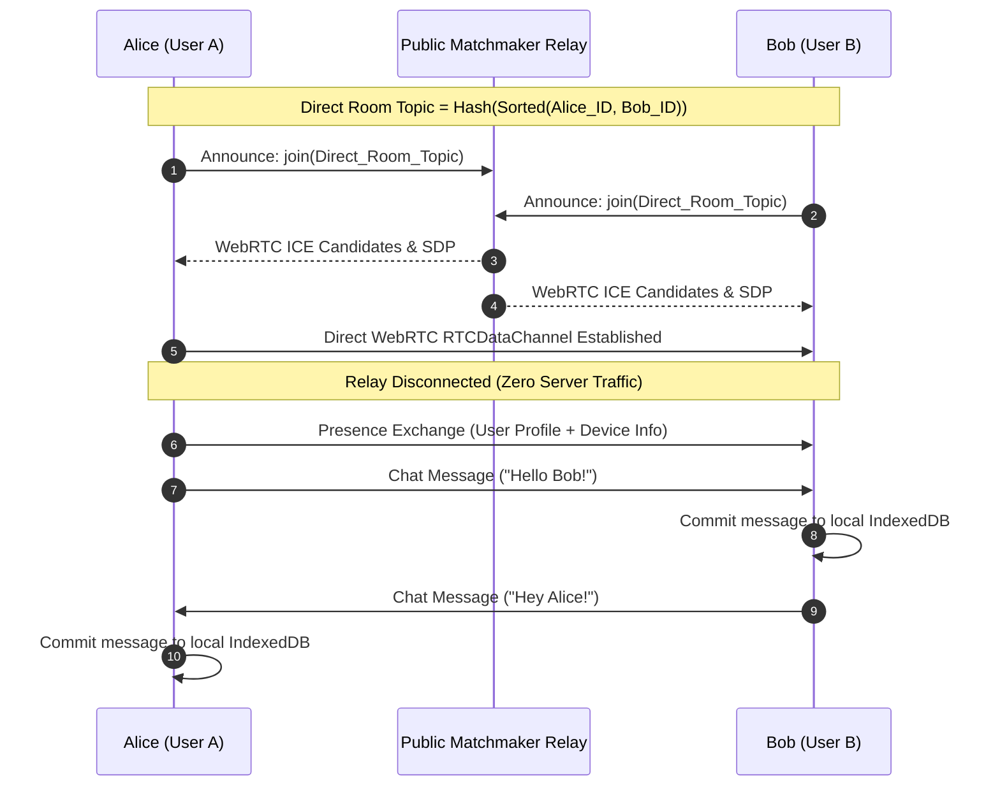

# Architecture Specification: Sovereign P2P Web Chat & Media Calls (MVP)

> **Document Status:** Production Architectural Blueprint (MVP)  
> **Target Runtime:** 100% Client-Side Modern Web Browser  
> **Philosophy:** Absolute Data Sovereignty • Zero-Central Servers • Ephemeral Matchmaking • Local-First Storage

---

## 1. Executive Summary & Core Vision

**Murmur** is an open-source, serverless, decentralized, local-first peer-to-peer web communication platform. It delivers real-time messaging, direct and group communications, and high-quality audio and video calls entirely within the browser without requiring central application servers, user accounts databases, or hosted communication middleware.

### Core Invariants:

1. **Zero Central Database & Application Servers**: No hosted backend, no PostgreSQL/Redis, and no accounts database.
2. **Ephemeral Signaling Matchmakers**: Public, decentralized relays (Nostr relays and BitTorrent WebTorrent trackers via Trystero) are utilized solely as blind matchmakers to exchange WebRTC SDP offer/answer coordinates. Once direct WebRTC channels are established, signaling traffic drops to zero.
3. **Local-First Persistence**: All user profile data, credentials, device keys, chat rooms, and message histories are persisted locally in the browser's IndexedDB via **Dexie**.
4. **Direct WebRTC Conduits**: Text messages travel over encrypted `RTCDataChannel`s, and audio/video calls stream peer-to-peer via native WebRTC `MediaStream`s.

---

## 2. System Architecture Layers

```
┌────────────────────────────────────────────────────────────────────────┐
│                        USER INTERFACE LAYER                            │
│           (React 19 + Tailwind CSS v4 + Lucide Icons)                  │
├──────────────────────────────────┬─────────────────────────────────────┤
│                                  │                                     │
│         ┌────────────────────────┴────────────────────────┐            │
│         ▼                                                 ▼            │
│ ┌───────────────────────────────┐        ┌───────────────────────────┐ │
│ │      AUTH & PROFILES          │        │     CHAT & CALLS UI       │ │
│ │  - Onboarding & Seed Wizard   │        │  - 1:1 & Group Chat View  │ │
│ │  - Profile & Device Manager   │        │  - Responsive Video Grid  │ │
│ └───────────────┬───────────────┘        └─────────────┬─────────────┘ │
└─────────────────┼──────────────────────────────────────┼───────────────┘
                  │                                      │
                  ▼                                      ▼
┌───────────────────────────────────┐  ┌─────────────────────────────────┐
│        STATE MANAGEMENT           │  │     P2P NETWORKING ENGINE       │
│  - useAuthStore (Zustand)         │  │  - Trystero (WebRTC Mesh)       │
│  - useChatStore (Zustand)         │  │  - Presence & Rosters           │
│                                   │  │  - DataChannels & MediaStreams  │
└─────────────────┬─────────────────┘  └─────────────────┬───────────────┘
                  │                                      │
                  ▼                                      ▼
┌────────────────────────────────────────────────────────────────────────┐
│                        LOCAL STORAGE LAYER                             │
│       (Dexie IndexedDB: Profiles, Credentials, Devices, Rooms, Messages)│
└────────────────────────────────────────────────────────────────────────┘
```

---

## 3. The 5 Core MVP Architectural Pillars

### Pillar 1: User Identity (Root Account)

Every user identity originates from a cryptographically secure 12-word or 24-word **BIP-39 mnemonic phrase**:

```
[ 24-Word BIP-39 Mnemonic ]
           │
           ▼
[ 512-bit Master Binary Seed ]
           │
           ├─► Ed25519 Identity Keypair (Signing & Account Verification)
           │     • Master Public Key (Hex): `0xABC...` (Canonical Account ID)
           │     • Master Private Key: Held only in local private storage
           │
           └─► User Profile Metadata (Display Name, Avatar, Bio, Timestamp)
```

- **Account Portability**: The user can export or restore their identity on any browser using their seed phrase.
- **Account Address**: The Master Public Key hex represents the user's permanent, shareable public address.

---

### Pillar 2: Device Identity (Local Client Instance)

Rather than introducing multi-device synchronization ratchets and companion QR pairing in the MVP, each browser installation generates a clean, isolated **Device Identity** bound to the User Identity:

```
┌────────────────────────────────────────────────────────┐
│                    DEVICE IDENTITY                     │
├────────────────────────────────────────────────────────┤
│ • deviceId: Deterministic or random UUID               │
│ • deviceName: Human-readable label ("Chrome on Linux") │
│ • accountId: The User Account ID this device represents│
│ • signingKey: Ed25519 Keypair (Signs device messages)  │
│ • encryptionKey: X25519 Keypair (Diffie-Hellman E2EE)  │
└────────────────────────────────────────────────────────┘
```

- **Separation of Concerns**: User identity represents _who_ is communicating; Device identity represents _which physical client_ is transmitting the message or media stream.
- **Clean Extensibility**: Lays the foundation for future multi-device pairing without burdening the MVP with slot derivation arrays or cross-device ratchets.

---

### Pillar 3: One-on-One (1:1) Chat

Direct messaging connects two peers over a private peer-to-peer WebRTC channel:



- **Deterministic Direct Rendezvous**: The room topic can be computed deterministically from the two participants' Account IDs:
  $$\text{DirectTopic} = \text{SHA256}(\min(ID_A, ID_B) + \text{":"} + \max(ID_A, ID_B))$$
- **Local Persistence**: Messages are saved to IndexedDB under `messages` indexed by `roomId`, ensuring chat history remains intact across page reloads.

---

### Pillar 4: Group Chat (Mesh Rooms)

Group chats operate as multi-peer WebRTC meshes:

```
                  ┌──────────────┐
                  │    Alice     │
                  └──────┬───────┘
                         │
             ┌───────────┴───────────┐
             │                       │
             ▼                       ▼
      ┌──────────────┐        ┌──────────────┐
      │     Bob      │◄──────►│   Charlie    │
      └──────────────┘        └──────────────┘
```

1. **Room Creation & Join**:
   - A user creates a room with a human-readable name (e.g. `team-sync`) and a unique `roomId` (or shareable room link).
   - Any peer with the `roomId` can join the room.
2. **Presence & Rosters**:
   - Upon joining, peers broadcast a `presence` payload containing their `UserProfile` and `DeviceIdentity`.
   - Each peer maintains a live `peers` map to display active participants.
3. **Broadcast Messaging**:
   - When a peer sends a message, it is broadcast to all active peers in the mesh over `RTCDataChannel`.
   - Each receiving client writes the message to their local Dexie IndexedDB.

---

### Pillar 5: Video & Audio Calls (Single & Group)

Murmur leverages WebRTC media streams via Trystero to provide seamless audio and video calling:

```
┌────────────────────────────────────────────────────────┐
│               IN-CALL MEDIA CONTROLS BAR               │
│ ┌──────────────┐ ┌──────────────┐ ┌──────────────────┐ │
│ │  Mic (Mute)  │ │ Video (Cam)  │ │ End Call (Leave) │ │
│ └──────────────┘ └──────────────┘ └──────────────────┘ │
└────────────────────────────────────────────────────────┘
```

1. **1:1 Calling**:
   - Initiated between two participants.
   - Layout: Side-by-side or active speaker with picture-in-picture local preview.
2. **Group Calling**:
   - Multi-peer WebRTC mesh calls in group rooms.
   - Dynamic, responsive video grid (1, 2, 3, 4+ tiles) adjusting automatically to participant count.
   - Individual participant tiles with:
     - Active video stream (or avatar placeholder when camera is off).
     - Participant display name.
     - Microphone mute/unmute indicator.
3. **Media Status Signaling**:
   - Peers exchange `media-status` payloads (`{ video: boolean, audio: boolean }`).
   - Ensures visual indicators update instantly when a peer mutes their mic or turns off their camera.

---

## 4. Production Technology Stack

| Layer                     | Technology                        | Purpose                                                                |
| :------------------------ | :-------------------------------- | :--------------------------------------------------------------------- |
| **Framework & UI**        | React 19 + Vite                   | High-performance reactive UI                                           |
| **Styling**               | Tailwind CSS v4                   | Clean, responsive design with full dark/light theme                    |
| **Icons**                 | Lucide React                      | Modern, consistent iconography                                         |
| **State Management**      | Zustand                           | Lightweight reactive stores (`authStore`, `chatStore`)                 |
| **Identity & Seed**       | `@scure/bip39`                    | BIP-39 mnemonic generation, seed conversion, validation                |
| **Cryptography**          | `@noble/curves` (Ed25519, X25519) | Fast, audit-friendly signing and Diffie-Hellman primitives             |
| **P2P Signaling & Media** | Trystero (Nostr / Torrent)        | Serverless WebRTC data and media mesh negotiation                      |
| **Local Storage**         | Dexie (IndexedDB)                 | Local-first persistence for profiles, credentials, rooms, and messages |

---

## 5. Security & Threat Model

| Threat Vector              | Mitigation Strategy                                                                                                   |
| :------------------------- | :-------------------------------------------------------------------------------------------------------------------- |
| **Relay Snooping**         | Matchmakers only broker ICE candidates. All data channels and media streams use standard DTLS/SRTP WebRTC encryption. |
| **No Central Leakage**     | Zero user data, message text, or passwords exist on any server.                                                       |
| **Seed Phrase Security**   | The BIP-39 mnemonic is stored only in the browser's sandboxed IndexedDB and can be backed up offline by the user.     |
| **Eavesdropping on Calls** | WebRTC media tracks are directly encrypted end-to-end between browsers using DTLS-SRTP.                               |

---

## 6. Post-MVP Roadmap & Future Enhancements

The following advanced capabilities are deferred to post-MVP milestones:

- **Multi-Device Companion Pairing**: Deterministic HKDF slot arrays and offline QR-based companion device linking.
- **PWA Service Worker**: Offline asset shell caching and Web Push background message ingestion.
- **Automerge CRDTs**: Offline concurrent document editing and change log replication.
- **OPFS File Streaming**: Origin Private File System zero-RAM multi-gigabyte file transfers.
